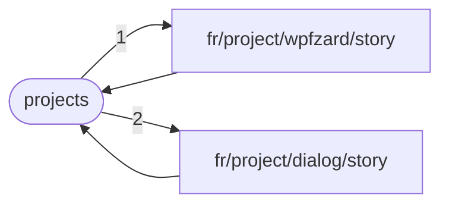

# Future me problems

Stuff I don't want to care about right now, but may need to be solved later.

## What if we need linked data in `fragment.php`?

`fragment.php` contains helpers for `*.phtml` scripts defining **linked** data. This means `linker.py` executes those scripts. Thus linked data is not available in `fragment.php` itself.

Actually, this is happening right now. We've added linking to `lang.json`, which is itself needed for constructing a Fragment. Which means that

1. The linker processes `lang.json`
2. It runs `fragments/en/langs/indexAboutMeContent.phtml`
3. Which instanciates a [Fragment](/main/scripts/include/fragment.php)
4. The constructor fetches the [Lang](/main/scripts/include/lang.php) instance
5. `Lang::instances()` calls `get_data_json('langs')`
6. `langs.json` has not yet been processed by the linker, so it is either a file not found error or we get an outdated version which was copied to the website directory by a previous generation.

This was bound to happen at some point, as passing false to get_data_json is just like saying "give me unlinked data".

How to solve this problem?

### 1. ~~Pass a dependency tree to the linker~~

This is rather cumbersome to do.

### 2. Perform linking "on the fly" in get_data_json

Why not? The function checks if the file has already been linked. If not it links it and copies it to the website directory.

The advantage is that we don't need a separate linker script that runs before everything else. This will greatly simplify the generation process.

Implementation:

- Remove the `$linked` argument to get_data_json, as it will now always returned linked data.
- Add a `link_file($file)` function that links a file and copies it to the website directory.
  - This function does what the current python script does, but for a single file. It should be called from `get_data_json` if the file has not yet been linked.

Now the issue is that we get infinite recursion with langs

As we need lang names in every page, we need to link langs.json before anything else.

What happens is:

1. generate root-index.php
2. fetches Lang instances
3. get the langs data json
4. get the fr/lang data json (which contains includes)
5. links the fr/lang data json
6. evaluates the phtml fragment
7. which also fetches the Lang instances (back to step 2)
8. ...

Hence the infinite recursion.

### Prompt

Hi, i'm fairly new to web development. I've been making a portfolio/blog website showcasing my various projects.

It's a static site hosted in GitHub pages. But I use PHP to generate the HTML pages before pushing them to the `gh_pages` branch (the GitHub pages deployment branch), while the scripts themselves are stored in the `main` branch. I have a Bash script `generate.bash` which executes PHP scripts for each page of my site : `index.php`, `projects.php`, effectively "generating" the website.

My site also uses JSON extensively make it easier to add content. For instance, the `projects.php` page I mentioned earlier reads into a `projects.json` JSON file that contains data about all my projects.

Files like `projects.json` are what I refer to in this project as "Data JSONs".

My site is multilingual. The available languages (currently only english and french, but I'm planning on adding more in the future) each have their own translated copy of each Data JSON, stored in subdirectories. Each language also has a Data JSON `lang.json` which contains general translated strings.

Here's the file structure of my project (shortened for brevity):

- portfolio
  - main (clone of the main branch)
    - data
      - en
        - lang.json
        - projects.json
      - fr
        - lang.json
        - projects.json
    - langs.json
    - fragments
      - en
        - lang
          - introduction.phtml
        - project
          - winclean
            - story.phtml
      - fr
        - lang
          - introduction.phtml
        - project
          - winclean
            - story.phtml
    - scripts
      - include
        - fragment.php
        - lang.php
        - util.php
      - generate.bash
      - index.php
      - projects.php
      - project.php
  - gh_pages (clone of the gh_pages branch)
    - css
      - ...
    - data
      - en
        - lang.json
        - projects.json
      - fr
        - lang.json
        - projects.json
    - en
      - index.html
      - projects.html
      - project
        - winclean.html
    - fr
      - index.html
      - projects.html
      - project
        - winclean.html

`langs.json` contains a simple array that defines the existing language. Its whole contents are `["en", "fr]`

The `fragments` directory contain `*.phtml` files for what I call "JSON linking". Basically, it got annoying to write HTML in JSON files, you know? Escaping double quotes, everything has to be in one line... So I changed my schemas to allow any string to be replaced by an object with a single key-value-pair to "include" a PHP file that will be evaluated and replaced by the HTML it produced in its standard output. Example with `data/en/lang.json`:

```json
{
  "introduction": {
    "$include": "fragments/en/lang/introduction.phtml"
  }
}
```

The contents of the `introduction.phtml` file are as follows (shortened for brevity)

```phtml
<?php
require_once 'fragment.php';
$f = start('en') ?>
<p>Hi, my name is... I'm a CS student...</p>
```

The `fragment.php` script gives the `start` function, which takes a language name (here `en`), and returns an instance of the `Fragment` class, which defines a few utility methods to simplify writing HTML.

Anyway, liking his handled by this part of my PHP code in (`util.php`)

```php
/** @var array<string, object> */
$_dataJsonCache = [];

/**
 * Decode and cache a data JSON file.
 * @param string $lang the langname or an empty string for language-agnostic data
 * @param string $name the filename of the JSON file, relative to the lang directory (or the date directory if $lang is null), without the extension.
 * @return array The decoded JSON, in associative mode.
 */
function get_data_json(string $lang, string $name): array
{
    global $_dataJsonCache;
    return $_dataJsonCache[$name] ??= _get_data_json_fetch($lang, $name);
}

/**
 * Fetche and decodes a data JSON file
 * @param string $name the filename of the JSON file, relative to the data directory, without the extension.
 * @return array The decoded JSON, in associative mode.
 */
function _get_data_json_fetch(string $lang, string $name): array
{
    $unlinked = json_decode(notfalse(file_get_contents(__DIR__ . "/../../data/$lang/$name.json"), "opening JSON data '$lang/$name'"), true);
    $linked = _link($unlinked, $lang);
    file_put_contents(get_web_filename("/gh-pages/data/$lang/$name.json"), json_encode($linked));
    assert(is_array($linked), "data JSON '$lang/$name' is not an array");
    return $linked;
}

function _link(mixed $data, string $lang): mixed
{
    if (is_array($data)) {
        if (count($data) === 1 && ($include = $data['$include'] ?? null)) {
            $filename = "../fragments/$lang/$include";
            ob_start();
            require $filename;
            return ob_get_clean();
        }
        foreach ($data as $key => $value) {
            $data[$key] = _link($value, $lang);
        }
    }

    return $data;
}
```

The `get_data_json` function is used to get Data JSONs and, as you can see, it automatically takes care of linking and saving the linked JSON to the `gh-pages` directory. We need to do this because we also use some Data JSONs in JavaScript (for search and filtering the project list, mainly), so they need to be available online.

The linked JSON for the abouve `lang.json` would look like:

```json
{"introduction":"<p>Hi, my name is... I'm a CS student...</p>"}
```

---

This was the description of my approach to programming this website. Reformulate what has been explain above to show you've understood.

---

I'm having an infinite recursion issue when I generate my website. This is because `fragment.php` fetches a Lang instance, which gets the localized `lang.json` data JSON. But `lang.json` itself has includes, so `fragment.php` is called again. Ad infinitum.

Here is the implementation of the Lang class (in `lang.php`):

```php
require_once 'util.php';

const INVARIANT_LANG_KEY = 'en';

final class Lang
{
    private static array|null $instances = null;
    /** @var array Lang data array */
    private readonly array $data;
    /** @var string Key used to lookup strings */
    readonly string $key;
    /** @var string Unique identifier */
    readonly string $name;
    private readonly IntlDateFormatter $fmt;

    function __construct(string $name, string $key, array $data)
    {
        $this->name = $name;
        $this->key  = $key;
        $this->data = $data;
        $this->fmt  = new IntlDateFormatter($key, IntlDateFormatter::LONG, IntlDateFormatter::NONE);
    }

    function formatDate(DateTimeInterface $dateTime)
    {
        return notfalse($this->fmt->format($dateTime), 'IntlDateFormatter::format');
    }

    function get(string $name): mixed
    {
        return $this->data[$name];
    }

    function nameof(Lang $other): string
    {
        return $this->data['names'][$other->key];
    }

    function fmtTitle(string $title): string
    {
        return sprintf($this->data['fmtTitle'], $title);
    }

    /**
     * Decode and cache a localized data JSON file.
     * @param string $name the filename of the JSON file, relative to the lang directory, without the extension.
     * @return array The decoded JSON, in associative mode.
     */
    function get_data_json(string $name): array
    {
        return get_data_json($this->name, $name);
    }

    /** @var array<string, array> */
    private readonly array $datas;

    /**
     * Get data objects
     * @template T
     * @param string $name Name of the data kind.
     * @param callable(string, array): T $makeObject Makes the data object
     * @return array<string, T> The data objects
     */
    private function get_data(string $name, callable $makeObject): array
    {
        return $this->datas[$name] ??= array_map_entries($makeObject, $this->get_data_json($name));
    }

    /**
     * Retrieves an array of definitions.
     *
     * @return array<string, Definition> An array of Definition objects, keyed by id.
     */
    function definitions(): array
    {
        return $this->get_data('definitions', fn($id, $json) => new Definition($this, $id, $json));
    }

    /**
     * Retrieves an array of Projects.
     *
     * @return array<string, Project> An array of Project objects, keyed by id.
     */
    function projects(): array
    {
        return $this->get_data('projects', fn($id, $json) => new Project($this, $id, $json));
    }

    /**
     * Retrieves an array of passion.
     *
     * @return array<string, Passion> An array of Passion objects, keyed by id.
     */
    function passions(): array
    {
        return $this->get_data('passions', fn($id, $json) => new Passion($this, $id, $json));
    }

    /**
     * Retrieves an array of perspectives.
     *
     * @return array<string, Perspective> An array of Perspective objects, keyed by id.
     */
    function perspectives(): array
    {
        return $this->get_data('perspectives', fn($id, $json) => new Perspective($this, $id, $json));
    }

    function equals(Lang $other): bool
    {
        return $this->name === $other->name;
    }

    /**
     * Get all langs, keyed by language name.
     * @return array<string, Lang> The instances of Lang, keyed by language name.
     */
    static function instances(): array
    {
        return static::$instances ??= static::fetch_instances();
    }

    /**
     * Fetch all langs, keyed by language name.
     * @return array<string, Lang> The instances of Lang, keyed by language name.
     */
    private static function fetch_instances(): array
    {
        $inst = [];
        foreach (get_data_json('', 'langs') as $lang) {
            $inst[$lang] = new static($lang, $lang, get_data_json($lang, 'lang'));
        }
        assert(array_key_exists(INVARIANT_LANG_KEY, $inst), 'Lang of invariant language key must exist');
        $inst[''] = new static('', INVARIANT_LANG_KEY, $inst[INVARIANT_LANG_KEY]->data);
        return $inst;
    }
}
```

The thing is, Fragment does not actually need Lang. It only needs a lang name and key which are known to be valid. I think I need to refactor the Lang class to solve this problem and separate the "language identification" and "localized data retrieval" concerns. What do you think? Don't hesitate to ask for clarification about my system.

---

The problem

Fragments require the evaluation of other fragments.

Eventually the dependency chain forms a circle. We get **cycles** in the fragment dependency graph, which results infinite recursion when linking.

Currently, cycles are ubiquitous, because the link the whole data json whenever we want 1 value from it.



Reducing cycles comes by increasing granularity. So basically instead of linking the whole document we only link the specific key that we need.

But this raises the question of: how to build the full linked data JSONs for JavaScript?

---

~~Screw this. How about we don't interpret the included PHTML immediately? We store it and run it when needed.~~

But this doesn't solve the problem not all cycles can be eliminated. A key that truly refers to itself cannot ever exist.

Does it make sense for a project title to refer to itself? No, it doesn't. Because that is the linked output then? That's right. Infinity. Just like recursive acronymys like <abbr title="GNU Is Not Unix Is Not Unix Is Not Unix Is Not Unix Is Not Unix Is Not Unix&hellip;">GNU</abbr>.

---

We pass an array of keys to `link`. It fetches the unlinked data JSON, caches it globally, and recursively traverses the document tree following each key. There, it links the current object and replaces it in the cached version.

Now, at the end of a script we just recursively link anything that hasn't already been and encode the linked JSON to the website directory.

We don't have to keep the current fragment name in mind, unless we want to prevent an infinite recursion in case we do have a cycle; in which case yes, a friendly error is arguably preferable to a crash. But at the same time, I want to keep the code simple, and I already have an entry in my `php.ini` to limit memory usage, so it's not like an infinite recursion would wreck my system. But it could on another system, or if I change the config or forget about it. After careful consideraion, I've decided not to implement this safety feature. I can always do it leter.

---

The problem of this code is that the return value of `get_data_json` cannot be reused to fetch subdata without interfering with the linking process.

Considering the following JSON in people.json:

```php
{
  "john-doe": {
    "name": {
      "John Doe"
    },
    "job": {
      "$include": "fragments/people/john-doe/job.phtml"
    },
  }
}
```

If we use get_data_json as such:

```phtml
<?php $johnDoe = get_data_json($lang, 'people', 'john-doe'); ?>
<p><?=$johnDoe['name']?> is a <?=$johnDoe['job']?></p>
```

The inclusion in `.john-doe.job` isn't resolved when fetching the `.john-doe` object.

This means we cannot to access properties of the object returned by get_data_json, so we have to do this:

```phtml
<p><?=get_data_json($lang, 'people', 'john-doe','name')?> is a <?=get_data_json($lang, 'people', 'john-doe', 'job')?></p>
```

This is rather cumbersome.

I have an idea for a better approach : how about we remove the path argument to `get_data_json` and wrap the returned data in an object, instance of a class `LinkedData` which provides `get` method (that takes a *key*, either `string` or `int`) returning a cached instance of `LinkedData` representing the linked data at the speicfied *key*?

The above example would be refactored as follows:

```phtml
<?php $johnDoe = get_data_json($lang, 'people')->get('john-doe'); ?>
<p><?=$johnDoe->get('name')?> is a <?=$johnDoe->get('job')?></p>
```
